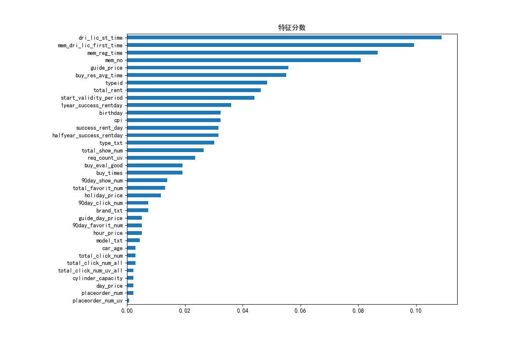
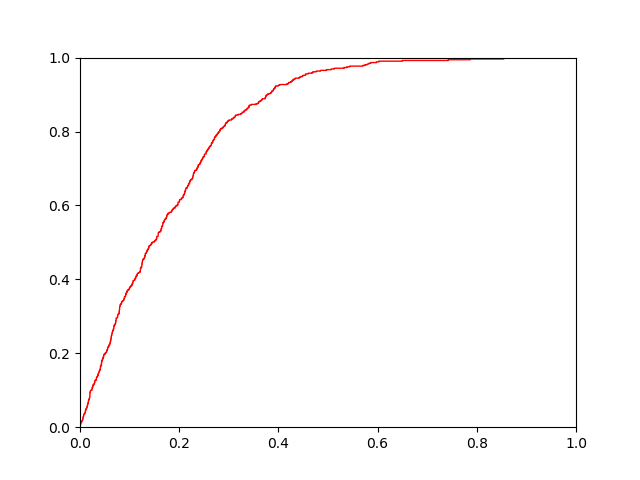
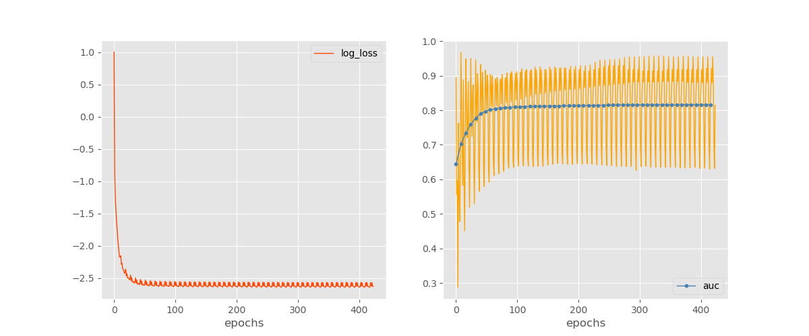

# DataService_Recommendation

推荐模型相关代码, 实现自pytorch

#### 特征工程相关

/feature_eng_xgboost.py : xgb特征分数计算

#### CTR预估模型相关

/model/*.py : 模型相关代码

/checkpoints/* : 训练日志和模型参数保存目录

/data/* : 数据集

/data_preprocess*.py : 数据预处理, 填补缺失值, 归一化等

预处理接口(填空值, 时间转换, 归一化等) `data_preprocess.get_dataset()`

数据集接口(one-hot, 训练/验证/测试集划分等) `data_preprocess.get_fm_data()`

/train.py : 模型的训练/推断

训练接口 `model.fit()`

模型载入接口 `model.load_state_dict()`

推断接口(标签) `model.predict()`

推断接口(概率) `model.predict_proba()`

/plot_loss_metric.py : 模型性能图标分析

AUC曲线

模型训练指标变化

#### 时间序列处理相关

/time_series_analysis.py : ARMA序列定阶

/time_series_analysis_arma.py : ARMA序列拟合
